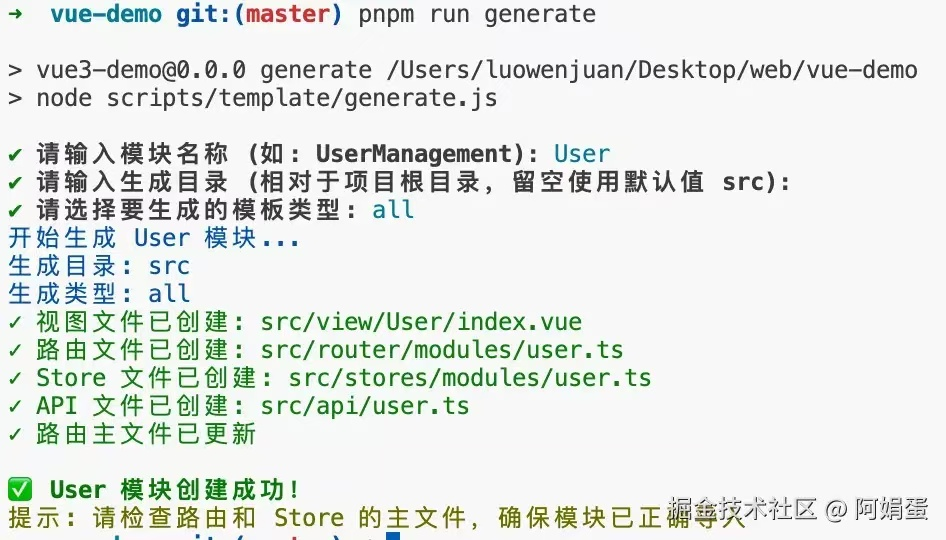

# 用Node脚本自动生成模块代码
## 业务背景

在新建业务模块时，我们通常需要手动创建文件夹、定义项目名称、新建模块文件，以及配置 `api` 和 `store` 等模块。这些步骤虽然必要，但每次重复操作会降低开发效率。

如果能通过一行指令自动生成这些模板文件，开发者只需定义模块名称，就能快速搭建项目基础结构，这将显著提升开发体验，减少重复劳动。

## 实现思路

通过 Node.js 脚本读取预设的模版文件，根据用户输入的模块名动态生成对应文件结构，并集成到 Vite 项目中。

## 具体步骤

### 1. 创建工具基础结构

```bash
scripts
└── template
    ├── api.template.js
    ├── router.template.js
    ├── store.template.js
    ├── view.template.js
    └── generate.js //node脚本
```

### 2. 安装必要的依赖

*   `inquirer`：是一个用于构建交互式命令行界面的 Node.js 库。它允许开发者通过命令行与用户进行交互，收集用户输入并根据输入执行相应的操作。

*   `commander`：是一个用于构建命令行界面的 Node.js 库。它提供了一种简单而强大的方式来定义和解析命令行参数，使得开发者能够轻松创建功能丰富的命令行工具。

*   `fs-extra`：是一个 Node.js 模块，扩展了内置的 fs（文件系统）模块，提供了更多的文件操作功能。它的目标是简化文件和目录的操作，使得开发者能够更方便地进行文件管理。

    *   `fs.ensureDirSync`：确保目录存在
    *   `fs.writeFileSync`：创建视图文件

*   `chalk`：是一个用于在 Node.js 命令行应用程序中为文本添加颜色和样式的库。它使得开发者能够轻松地为控制台输出的文本添加颜色、背景色、加粗、下划线等样式，从而提高命令行界面的可读性和美观性。

*   `process`：是 Node.js 的**内置模块**，提供了与当前 Node.js 进程相关的功能和信息。它是一个全局对象，开发者可以在任何地方直接使用，而无需显式导入。

### 3. 创建模版文件

以`api.template.js`为例：

```js
export default name => `import request from '@/utils/http'

const baseUrl = '/api/${name.toLowerCase()}'

// 获取${name}列表
export function fetch${name}List(params) {
  return request.get(`${baseUrl}/list`, params)
}

// 获取${name}详情
export function fetch${name}Detail(id) {
  return request.get(`${baseUrl}/${id}`)
}

// 创建${name}
export function create${name}(data) {
  return request.post(baseUrl, data)
}

// 更新${name}
export function update${name}(id, data) {
  return request.put(`${baseUrl}/${id}`, data)
}

// 删除${name}
export function delete${name}(id) {
  return request.delete(`${baseUrl}/${id}`)
}
`
```

### 4. 建生成器脚本

创建 `scripts/template/generate.js` 文件：

```js
#!/usr/bin/env node

import fs from 'fs-extra'
import path from 'path'
import { fileURLToPath } from 'url'
import { program } from 'commander'
import chalk from 'chalk'
import inquirer from 'inquirer'
import process from 'process' // 添加这一行以导入 process 模块

// 导入模板
import viewTemplate from './view.template.js'
import routerTemplate from './router.template.js'
import storeTemplate from './store.template.js'
import apiTemplate from './api.template.js'
// 获取 __dirname 等价物
const __filename = fileURLToPath(import.meta.url)
const __dirname = path.dirname(__filename)
// 项目根目录
const PROJECT_ROOT = path.resolve(__dirname, '../..')
// 默认各模块路径
const DEFAULT_PATHS = {
  views: path.join(PROJECT_ROOT, 'src/view'),
  router: path.join(PROJECT_ROOT, 'src/router/modules'),
  store: path.join(PROJECT_ROOT, 'src/stores/modules'),
  api: path.join(PROJECT_ROOT, 'src/api')
}
// 模板类型
const TEMPLATE_TYPES = ['all', 'view', 'router', 'store', 'api']
// 首字母大写
const capitalize = str => str.charAt(0).toUpperCase() + str.slice(1)
// 生成模块
async function generateModule(name, options) {
  const moduleName = capitalize(name)
  const { directory, type } = options

  // 根据用户指定的目录创建自定义路径
  const PATHS = { ...DEFAULT_PATHS }

  if (directory) {
    const customDir = path.join(PROJECT_ROOT, directory)
    PATHS.views = path.join(customDir, 'view')
    PATHS.router = path.join(customDir, 'router/modules')
    PATHS.store = path.join(customDir, 'stores/modules')
    PATHS.api = path.join(customDir, 'api')
  }

  // 确保目录存在
  Object.values(PATHS).forEach(dir => {
    fs.ensureDirSync(dir)
  })

  console.log(chalk.blue(`开始生成 ${moduleName} 模块...`))
  console.log(chalk.blue(`生成目录: ${directory || 'src'}`))
  console.log(chalk.blue(`生成类型: ${type || 'all'}`))

  try {
    // 根据类型生成对应文件
    const shouldGenerateAll = type === 'all' || !type

    // 创建 API 文件
    if (shouldGenerateAll || type === 'api') {
        fs.writeFileSync(path.join(PATHS.api, `${name.toLowerCase()}.ts`), apiTemplate(moduleName))
        console.log(chalk.green(`✓ API 文件已创建: ${path.relative(PROJECT_ROOT, PATHS.api)}/${name.toLowerCase()}.ts`))
    }

    // 创建视图文件
    if (shouldGenerateAll || type === 'view') {
      const viewDir = path.join(PATHS.views, moduleName) // 生成视图文件目录
      fs.ensureDirSync(viewDir) // 确保目录存在
      fs.writeFileSync(path.join(viewDir, `index.vue`), viewTemplate(moduleName)) // 创建视图文件
      console.log(chalk.green(`✓ 视图文件已创建: ${path.relative(PROJECT_ROOT, viewDir)}/index.vue`))
    }

    // 创建路由文件
    //...其他代码类似

    // 创建 Store 文件
    //...其他代码类似

    console.log(chalk.green.bold(`\n✅ ${moduleName} 模块创建成功！`))
    console.log(chalk.yellow(`提示: 请检查路由和 Store 的主文件，确保模块已正确导入`))
	} catch (error) {
    console.error(chalk.red('❌ 生成模块时出错:'), error)
	}
}

// 设置命令行参数
program
	.version('1.0.0')
	.description('Vue 模块生成器 - 快速创建视图、路由、Store 和 API 文件')
	.option('-n, --name <name>', '模块名称')
	.option('-d, --directory <path>', '指定生成目录，相对于项目根目录 (默认: src)')
	.option('-t, --type <type>', `指定生成的模板类型 (${TEMPLATE_TYPES.join('|')})`, 'all')
	.parse(process.argv)

const options = program.opts()

// 主函数
async function main() {
    let moduleName = options.name
    const { directory, type } = options

    // 验证模板类型
    if (type && !TEMPLATE_TYPES.includes(type)) {
        console.error(chalk.red(`❌ 无效的模板类型: ${type}`))
        console.log(chalk.yellow(`有效的模板类型: ${TEMPLATE_TYPES.join(', ')}`))
        process.exit(1)
    }
    // 如果没有提供名称，则提示用户输入
    if (!moduleName) {
        const answers = await inquirer.prompt([
        {
            type: 'input',
            name: 'name',
            message: '请输入模块名称 (如: UserManagement):',
            validate: input => input.trim() !== '' || '模块名称不能为空'
        },
        {
            type: 'input',
            name: 'directory',
            message: '请输入生成目录 (相对于项目根目录，留空使用默认值 src):',
            default: directory || ''
        },
        {
            type: 'list',
            name: 'type',
            message: '请选择要生成的模板类型:',
            choices: TEMPLATE_TYPES,
            default: type || 'all'
        }])
        moduleName = answers.name
        options.directory = answers.directory || directory
        options.type = answers.type || type
     }
    // 生成模块
    await generateModule(moduleName, options)
}
// 执行主函数
main().catch(err => {
	console.error('执行出错:', err)
	process.exit(1)
})
```

### 5. 集成到 vite 中

*   **在**`package.json`**中添加脚本**：

```json
{
  "scripts": {
    "generate": "node scripts/generator.js"
  }
}
```

*   **使模块生成器可执行：**

```bash
chmod +x scripts/generate.js
```

*   **使用命令生成模块**：

```bash
pnpm run generate user  # 生成user模块的Router、Store等
```

## 实现效果

执行命令：`pnpm run generate`



执行命令后，将生成以下文件：

```bash
src/
├─ views/
│  └─ user/
│     └─ index.vue     # 自动生成View
├─ router/
│  └─ modules/
│     └─ user.ts       # 自动生成路由配置
├─ stores/
│  └─ user.ts          # 自动生成Pinia Store
```
